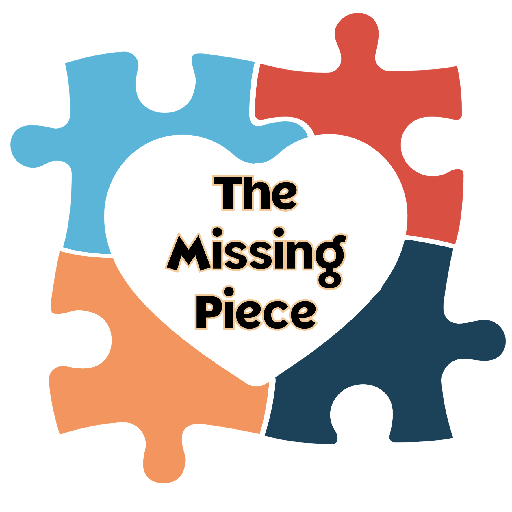
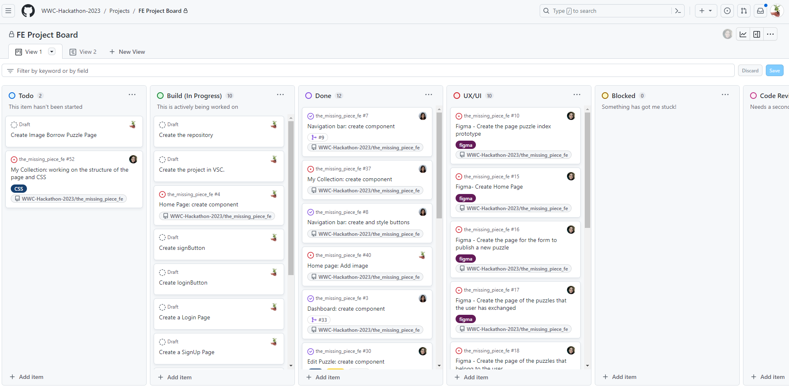
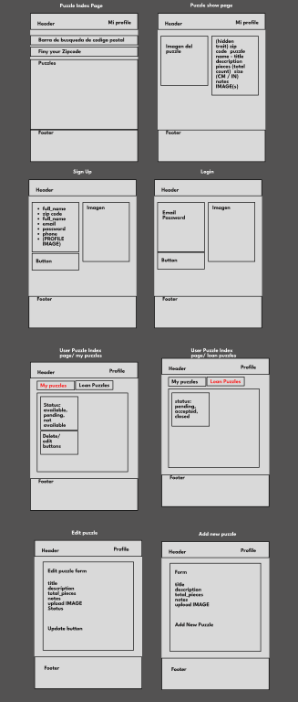
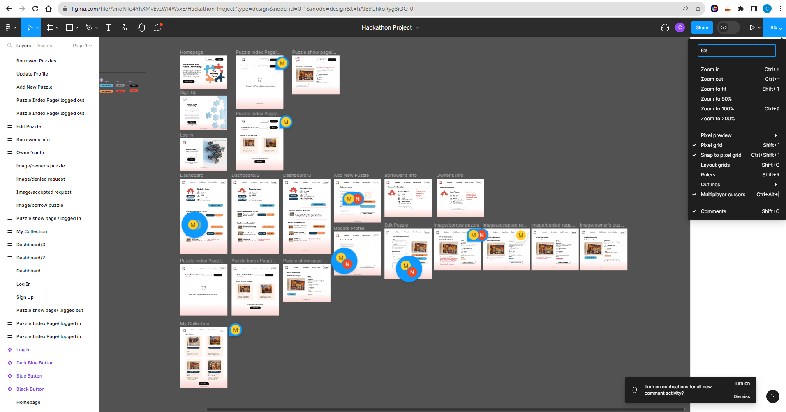

# THE MISSING PIECE

## Index.

* [1. Summary](#1-Summary)
* [2. About Project](#2-resumen-del-proyecto)
* [3. Planning](#3-Planning)
* [4. Prototype (UX design)](#4-Prototype-(UX-design))
* [5. Project](#5-Project)
* [6. Checklist](#6-checklist)

***
Technical Documentation of the Library

## 1. Summary

The Missing Piece was created by an international team of both FrontEnd and BackEnd developers for the Women Who Code (WWC)  [Hackathon for Social Good 2023.](https://hopin.com/events/wwcode-hackathon-for-social-good/registration) 

"Join the Women Who Code Hackathon for Social Good 2023 and use your superpowers to create a solution for the social good. The hackathon offers an amazing and engaging learning experience for the WWCode community while we develop projects that promote social good."

## 2. About Project.

The Missing Piece is an application designed to make it easier for puzzle enthusiasts to lend and borrow puzzles. It is primarily aimed at older adults who have a passion for this wonderful hobby and wish to expand their opportunities for enjoyment by temporarily exchanging their own puzzles. This way, they can gain access to a wider variety of puzzles. Please enhance the purpose of this platform through improved communication and provide me with a text in English

## 3. Planning.

The planning was executed using the GitHub Project platform, which provided a robust and efficient environment for managing tasks and collaborating on the project. This allowed for seamless organization, tracking, and enhanced visibility into the project's progress

## 4. Prototype (UX design).

[Low-fidelity prototype:](https://www.figma.com/file/AmoNTo4YhXMvEvzWl4WxxE/Hackathon-Project?type=design&node-id=0-1&mode=design&t=hAI89GhkoRyg8iQQ-0)

[high-fidelity prototype:](https://www.figma.com/file/AmoNTo4YhXMvEvzWl4WxxE/Hackathon-Project?type=design&node-id=0-1&mode=design&t=hAI89GhkoRyg8iQQ-0)

## 5. Project

Deployment link: https://the-missing-piece.vercel.app/

## 6. Teamwork

*FrontEnd Team:*

* Natalia Torrejon - [LinKedin](https://www.linkedin.com/in/natalia-torrejon-developer/)

* Andrea Ramirez - [LinKedin](https://www.linkedin.com/in/paola-andrea-ramirez-quintero/)

* Carmen Luna - [LinKedin](https://www.linkedin.com/in/carmen-luna-cllp/)
